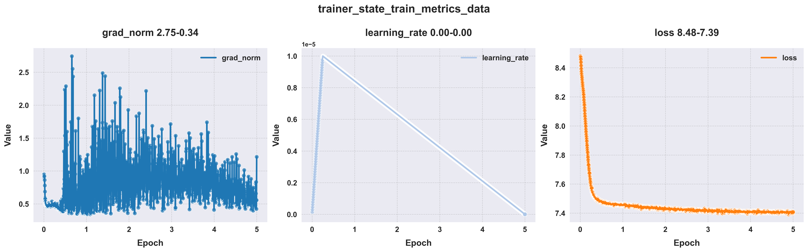

# TropicBERT: A Genomic Foundation Model for Tropical Fruit Crops

[](https://www.python.org)
[](https://huggingface.co/yang0104/TropicBERT)
[](https://github.com/yanglin789/TropicBERT-LLMs_One_stop_tutorial)

---
## 📖 Project Overview

**TropicBERT-LLMs_One_stop_tutorial** is a fully open-source pipeline that transfers the "pre-training and fine-tuning" paradigm from natural language processing (NLP) to genomics.

Based on this training pipeline, we developed the **TropicBERT** model series. **TropicBERT** is the first genomic foundation model specifically designed for **10 tropical fruit species**, aiming to bring Transformer techniques from NLP to DNA sequence analysis.

**Key Features:**
- 🧬 **Genome Pre-training**: Learns genomic sequence features via Masked Language Modeling (MLM).
- 🎯 **Downstream Task Fine-tuning**: Supports regression and classification tasks such as promoter strength prediction and chromatin accessibility prediction.
- 📊 **End-to-End Support**: Provides complete code for raw FASTA processing, model training, and result visualization.

Suitable for researchers from diverse backgrounds to get started quickly.

---
## 🎯 Highlights

- **Complete Workflow**: Raw FASTA → Standardization → Pre-training → Fine-tuning → Visualization
- **Fully Open Source**: Code, model weights, tokenizer, and tutorials are all publicly available.
- **Reproducible**: Standardized data processing and training scripts for researchers of all backgrounds.
- **Tropical Fruit Pre-trained Model**: The first genomic pre-trained model for tropical fruit crops.
- **Multi-scale Models**: Provides pre-trained model variants based on 1 / 5 / 10 species, with strong cross-species transferability.

---

## 📂 Project Structure

```plaintext
TropicBERT-LLMs_One_stop_tutorial/
├── 00-info/                            # Environment setup and data preprocessing
├── 01-pretrain_all/                    # Pre-training module
│   ├── 01-code-pretrain/               # Core pre-training code
│   ├── 02-model_pretrain_example/      # Pre-trained model examples
│   └── 03-data_pretrain_example/       # Pre-training data examples
├── 02-finetune_all/                    # Fine-tuning module
│   ├── 01-code-finetune/               # Core fine-tuning code
│   ├── 02-model_finetune_example/      # Fine-tuned model examples
│   └── 03-data_finetune_example/       # Fine-tuning data examples
└── 03-Result-Processing_Plotting/      # Result processing and visualization
└── 04-Data-processing/                 # Raw data preprocessing scripts
```

---

## ⚙️ Environment Requirements

**Recommended Configuration:**
- Python >= 3.11
- Conda >= 25.7.0
- NVIDIA GPU with ≥ 16GB VRAM
- CUDA 12.1 (or compatible with your PyTorch version)

**Main Dependencies:**
```txt
- Conda 25.7.0
- Python 3.11.11
- PyTorch 2.8.0+cu128
- Transformers 4.57.0
```
See `environment.yml` for the full list.

---

## 🚀 Quick Start

### 1️⃣ Environment Setup

```bash
# Go to the directory containing environment files
cd 00-info/

# Option 1: Create a new environment with conda (recommended)
conda env create -f environment.yml -n AI_env
conda activate AI_env

# Option 2: Install dependencies with pip
pip install -r requirements.txt
```
You can set up the environment using either conda (recommended) or pip.

---

### 2️⃣ Pre-training (Genomic Sequence Masking)

Use Masked Language Modeling (MLM) for self-supervised learning on genomic sequences.

**Preparation Work**:
1. **Model and Tokenizer Download**: Download the model files and tokenizer from [HuggingFace](https://huggingface.co/yang0104/TropicBERT).
2. **Model and Tokenizer Adaptation**:
    - If the downloaded model is TropicBERTs, there is no need to modify the tokenizer; you can directly use the downloaded tokenizer.
    - If using other NLP models, only use their model files, and for the tokenizer, use the one provided in the example files.
3. **File Placement**: Place the downloaded model files and tokenizer (or the tokenizer file from the example) in the `01-pretrain_all/02-model_pretrain_example/` directory. For TropicBERTs models, also follow this path for placement.
4. **Data Preparation**: You can use the data in the example dataset `01-pretrain_all/03-data_pretrain_example/`, or modify it according to your actual needs to use your own dataset.

**Example Run:**
```bash
cd 01-pretrain_all/01-code-pretrain

# Option 1: Run via bash command line
python 01-pretrain.py \
    --model_name_or_path ../02-model_pretrain_example/bert-6MER-retokenizer \
    --train_data ../03-data_pretrain_example/pretrain_data.txt \
    --output_dir output_pretrain

# Option 2: Run via bash script (recommended for project management)
bash 02-pretrain.sh
```


---
### 3️⃣ Fine-tuning (Downstream Tasks)
Fine-tune the model on downstream tasks (e.g., promoter prediction).

**Preparation:**
1. Copy the pre-trained model checkpoint to:
`02-finetune_all/02-model_finetune_example/`
2. Use the sample data in `02-finetune_all/03-data_finetune_example/` or replace with your own dataset.

**Run Fine-tuning:**
```bash
cd 02-finetune_all/01-code-finetune

# Option 1: Run via bash command line
python 01-finetune.py \
    --model_name_or_path ../02-model_finetune_example/pretrained_bert_6MER_ckpt40 \
    --train_task regression \
    --reinit_classifier_layer True \
    --train_data ../03-data_finetune_example/regression_train_data.csv \
    --eval_data ../03-data_finetune_example/regression_dev_data.csv \
    --test_data ../03-data_finetune_example/regression_test_data.csv \
    --output_dir output_finetune \
    --run_name runs_finetune \
    --model_max_length 512 \
    --gradient_accumulation_steps 4 \
    --per_device_train_batch_size 16 \
    --per_device_eval_batch_size 16 \
    --num_train_epochs 5 \
    --logging_steps 50 \
    --eval_steps 50 \
    --save_steps 1000 \
    --warmup_ratio 0.05 \
    --weight_decay 0.01 \
    --learning_rate 1e-5 \
    --save_total_limit 5

# Option 2: Run via bash script (recommended for project management)
bash 02-finetune.sh
```

---
### 4️⃣ Result Visualization
Provides scripts for extracting training logs, evaluation results, and plotting figures:

```bash
cd 03-Result-Processing_Plotting

# Extract metrics and plot (modify paths in scripts as needed)
python 01_sort_out_result_files.py
python 02_test_metrics_extract_csv.py
python 03_Extract_draw_trainer_state.py
```
(You may need to modify input/output paths in the scripts according to your directory structure.)


**Example Output:**


---

## 📊 Data Processing & Formats


### Pre-training Data (TXT)
The `04-Data-processing/` directory contains scripts for pre-training data processing
```txt
ATCGATCGATCG...
GCTAGCTAGCTA...
```
If you want to use your own FASTA data for training, please preprocess your data first.
*This step cleans, splits, and converts FASTA sequences into TXT format readable by the model. Genome FASTA files are extracted, sequences shorter than 10,000 bp are filtered out, all bases are converted to uppercase, 'N' bases are randomly replaced with one of ATGC, and sequences are split into non-overlapping chunks of 3060 bp (according to BERT's max input tokens), saved as txt files for model training.*


```bash
cd 04-Data-processing

# Run scripts in order (edit file_paths in scripts as needed)
python 01_pretrain_data_one_step.py   # Sequence extraction and filtering
python 02_pretrain_data_two_step.py   # Base normalization and replacement
python 03_pretrain_data_three_step.py # Sequence splitting (Sliding Window)
python 04_pretrain_data_txt_merge.py  # Merge into training set
```
> **Data Format:** The final pre-training data is in `.txt` format, one sequence per line (e.g., 512bp or 3060bp), all bases uppercase.


(You may need to modify file input/output paths in the scripts according to your directory structure), for example：

```python
file_paths = [
        "~/01_fasta_data/genome_ID1.fasta",
        "~/01_fasta_data/genome_ID2.fasta"]

output_path = "~/01_fasta_data/01_reads_output"
```

### Fine-tuning Data (CSV)
Open-source datasets are standardized to retain only sequence and label columns; other descriptive information is omitted.

```csv
label,sequence
0.1,ATCGATCGATCGATCG...
0.9,GCTAGCTAGCTAGCTA...
```

**Downstream Tasks：**

Fine-tuning data and the corresponding base models are used for downstream genomic analysis tasks. Based on [plant-genomic-benchmark](https://huggingface.co/datasets/InstaDeepAI/plant-genomic-benchmark) and [PDLLMs](https://huggingface.co/zhangtaolab/datasets), six types of downstream tasks (plant genomics) are supported. Datasets are split into train:dev:test ≈ 8:1:1, including 9 datasets：

| Task Type | Dataset Type               | Sample Size                | Description                                             |
| :-------: | :-----------------------:  | :-----------------------:  | :-----------------------------------------------------: |
| Regression| Promoter strength          | 72158/75808                | Promoter strength prediction (leaf/protoplast)          |
| 3-class   | Open chromatin prediction  | 148500                     | Open chromatin prediction                               |
| Binary    | lncRNA prediction          | 50308                      | Long non-coding RNA prediction                          |
| Binary    | Sequence conservation      | 70400                      | Sequence conservation prediction                        |
| Binary    | Core promoter detection    | 83200                      | Core promoter detection                                 |
| Binary    | Histone modification       | 102400/102400/99684        | Histone modification prediction (H3K4me3/H3K27ac/H3K27me3) |

---

## 📥 Model Download
👉 **HuggingFace Hub**🤗 : [https://huggingface.co/yang0104/TropicBERT](https://huggingface.co/yang0104/TropicBERT)

Includes:
- All 13 pre-trained variants (1 / 5 / 10 species)
- Custom DNA Tokenizer

---

## 📝 Citation


If you use TropicBERT or this pipeline, please cite：

```bibtex

```

---

## 📧 Contact

For questions, please submit an [Issue](https://github.com/yanglin789/TropicBERT-LLMs_One_stop_tutorial/issues) or contact:  
📩 1264894293yl@gmail.com

**Democratizing plant genomic LLMs—starting from tropical fruits.**

---

## Star History

[](https://star-history.com/#your-username/GenomePT&Date)